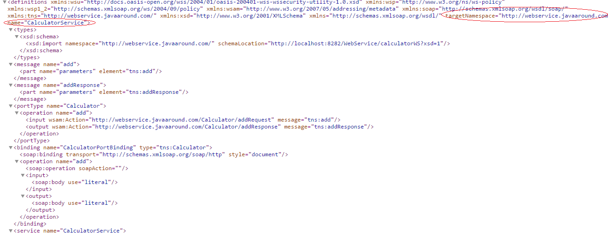

### Web Service ###

A Web service is a service offered by an electronic device to another electronic device, communicating with each other via the Internet.It can be used any operating system or programming language Independently

### Web Service Design Way ###

1. SOAP Based Way
2. REST Way

### SOAP Based ###

 SOAP(Simple object access protocal) is a protocal that internally use HTTP POST.it is XML based used for sending and receiving messages.

 `WSDL(Web Services Description Language)` : standard format for describing a web service

 `<types>`	Defines the (XML Schema) data types used by the web service <br/>
 `<message>`	Defines the data elements for each operation<br/>
 `<portType>`	Describes the operations that can be performed and the messages involved.<br/>
 `<binding>`	Defines the protocol and data format for each port type

### UDDI ###

 UDDI(Universal Description, Discovery, and Integration.) is an XML-based standard for describing, publishing, and finding web services
 1. Service provider registers WSDL to UDDI.
 2. Client searches for service in UDDI.
 3. UDDI returns all service providers offering that service.
 4. Client chooses service provider
 5. UDDI returns WSDL of chosen service provider.
 6. Using WSDL of service provider,client accesses web service

Read more at http://www.java2blog.com/2013/03/soap-web-service-tutorial.html#mjQ2BuYS7fGbWSqC.99

### How to start ###
  
1. create java maven project <br/>
	mvn archetype:generate -DgroupId=com.javaaround -DartifactId=WebService -DarchetypeArtifactId=maven-archetype-quickstart -DinteractiveMode=false
 Java design `jax-ws` api to work on soap based web service 
	
3. create CalculatorService.java

```java
package com.javaaround.webservice;

import javax.jws.WebMethod;
import javax.jws.WebService;

//Service Endpoint Interface
@WebService
public interface CalculatorService{

	@WebMethod 
	public int add(int num1 , int num2);

}
```	
create Calculator.java

```java
package com.javaaround.webservice;

import com.javaaround.webservice.CalculatorService;
import javax.jws.WebMethod;
import javax.jws.WebService;

//Service Endpoint Interface
@WebService(endpointInterface = "com.javaaround.webservice.CalculatorService",serviceName="calculatorService")
public class Calculator implements CalculatorService{

	@Override
	public int add(int num1 , int num2){
		return num1 + num2;
	}

}
```
### Publish web service way ###

1. Programming way
2. deploy existing servlet container(tomcat)

### Programming way ###

create CalculatorPublisher.java
```java
package com.javaaround.client;

import javax.xml.ws.Endpoint;  
import com.javaaround.webservice.Calculator;
//Endpoint publisher  
public class CalculatorPublisher{  
    public static void main(String[] args) {  
       Endpoint.publish("http://localhost:7779/ws/calculator", new Calculator());  
    }  
}  
```
### How to get WSDL File ###
http://localhost:7779/ws/calculator

### deploy into tomcat ###

add dependency at pom.xml

```xml
   <dependency>
        <groupId>com.sun.xml.ws</groupId>
        <artifactId>jaxws-rt</artifactId>
        <version>2.2.10</version>
     </dependency>
  ```

4. update web.xml

```xml
<?xml version="1.0" encoding="UTF-8"?>
<web-app xmlns:xsi="http://www.w3.org/2001/XMLSchema-instance"
    xmlns="http://xmlns.jcp.org/xml/ns/javaee"
    xsi:schemaLocation="http://xmlns.jcp.org/xml/ns/javaee http://xmlns.jcp.org/xml/ns/javaee/web-app_3_0.xsd"
    id="WebApp_ID" version="3.0">
    <display-name>JAXWS-Tomcat</display-name>
 
    <listener>
        <listener-class>
            com.sun.xml.ws.transport.http.servlet.WSServletContextListener</listener-class>
    </listener>
     
    <servlet>
        <servlet-name>JAXWSServlet</servlet-name>
        <servlet-class>com.sun.xml.ws.transport.http.servlet.WSServlet</servlet-class>
        <load-on-startup>1</load-on-startup>
    </servlet>
    <servlet-mapping>
        <servlet-name>JAXWSServlet</servlet-name>
        <url-pattern>/calculatorWS</url-pattern>
    </servlet-mapping>
    <session-config>
        <session-timeout>30</session-timeout>
    </session-config>
     
</web-app>
```
create sun-jaxws.xml under `WEB-INF`

```xml
<?xml version="1.0" encoding="UTF-8"?>
<endpoints xmlns="http://java.sun.com/xml/ns/jax-ws/ri/runtime" version="2.0">
  <endpoint
     name="calculatorWS"
     implementation="com.javaaround.webservice.Calculator"
     url-pattern="/calculatorWS"/>
</endpoints> 
```

5. create war file by following command

`mvn clean package`
deploy WebService.war file on Tomcat(container)<br>

### How to get WSDL File ###
http://localhost:8080/WebService/calculatorWS?wsdl



Yes.  web service is ready.We can use Now

### Usage of own server ###

create CalculatorClient.java

```java
package com.javaaround.client;

import java.net.URL;
import javax.xml.namespace.QName;
import javax.xml.ws.Service;
import com.javaaround.webservice.CalculatorService;

public class CalculatorClient{

	public static void main(String[] args) throws Exception {

		URL url = new URL("http://localhost:8080/WebService/calculatorWS?wsdl");

        //1st argument service URI, refer to wsdl document above
	    //2nd argument is service name, refer to wsdl document above
        QName qname = new QName("http://webservice.javaaround.com/", "CalculatorService");

        Service service = Service.create(url, qname);

        CalculatorService calculatorService = service.getPort(CalculatorService.class);

        System.out.println("sum of 2 and 5 are : " + calculatorService.add(2,5));

    }

}
```

`QName qname = new QName(targetNamespace, name);` that is marked above image

add plugin pom.xml

```xml
<plugin>
  <groupId>org.codehaus.mojo</groupId>
  <artifactId>exec-maven-plugin</artifactId>
  <version>1.4.0</version>
  <executions>
    <execution>
      <id>my-execution</id>
      <!-- if skip phase: none -->
      <phase>package</phase>
      <goals>
        <goal>java</goal>
      </goals>
    </execution>
  </executions>
  <configuration>
    <mainClass>com.javaaround.client.CalculatorClient</mainClass>
    <!--<classpathScope>main</classpathScope> defualt-->
     <arguments>  
       <argument>arg0</argument>  
       <argument>arg1</argument>  
     </arguments>  
  </configuration>
</plugin>
```

Run `mvn clean package` to see output

### Usage of desktop App  ###
`wsimport` is used generate java code  based on wsdl file.By the help of java code we can use web service
it is located on $JAVA_HOME\bin\wsimport

1. create desktop App java
mvn archetype:generate -DgroupId=com.javaaround.webservice.clientApp -DartifactId=WSclientApp -DarchetypeArtifactId=maven-archetype-quickstart -DinteractiveMode=false

2.  use the command under src/main/java directory `wsimport -keep -p com.javaaround.webservice.clientApp  http://localhost:8080/WebService/calculatorWS?wsdl` 

this will generate App.java , AddResponse.java , Calculatore.java etc

3. Update App.java
```java
package com.javaaround.webservice.clientApp;

/**
 * Hello world!
 *
 */

public class App 
{
    public static void main( String[] args )
    {
        CalculatorService_Service service = new CalculatorService_Service();
    CalculatorService calculatorService = service.getCalculatorPort();
        System.out.println("sum of 2 and 5 are : " + calculatorService.add(2,5));
    }
}

```
### Usage of Jave web App  ###

```java
@WebServiceRef(wsdlLocation = 
      "http://localhost:8080/WebService/calculatorWS?wsdl")
private HelloService service;
```

### REST Web Service ###
REST(REpresentational State Transfer)ful Web Services are Architecture style where every content is a resource and can be represented many format(xml,json,html,pdf).<br/>
In REST,a resource is accessed directly by a URI .as  a result REST is commonly(widly) used to create APIs for web based applications.

### HTTP Methods ###
1. GET - Provides a read only access to a resource.
2. PUT - Used to create a new resource.
3. DELETE - Used to remove a resource.
4. POST - Used to update a existing resource or create a new resource.
5. OPTIONS - Used to get the supported operations on a resource

### URI Format ###

`<protocol>://<service-name>/<ResourceType>/<ResourceID>`

1. Use Plural Noun
2. Avoid using spaces
3. use lowercase letters

poor uri : <br>
http://localhost:8080/UserManagement/rest/UserService/getUser/1<br>
good uri<br>
http://localhost:8080/UserManagement/rest/UserService/users/1

Java design `jax-rs` api to work on REST based web service 

### implementation JAX-RS ###
There are following implementation of JAX-RS API for work easily

1. Jersey
2. RESTEasy
3. Apache CFX

### How to start with Jersey ###

add dependency at pom.xml
```xml
<dependency>
  <groupId>com.sun.jersey</groupId>
  <artifactId>jersey-server</artifactId>
  <version>1.8</version>
</dependency>
```

add servlet at web.xml

```xml
</servlet-mapping>
      <servlet>
      <servlet-name>jersey-serlvet</servlet-name>
      <servlet-class>
                   com.sun.jersey.spi.container.servlet.ServletContainer
              </servlet-class>
      <init-param>
           <param-name>com.sun.jersey.config.property.packages</param-name>
           <param-value>com.javaaround.webservice</param-value>
      </init-param>
      <load-on-startup>1</load-on-startup>
  </servlet>

  <servlet-mapping>
      <servlet-name>jersey-serlvet</servlet-name>
      <url-pattern>/rest/*</url-pattern>
  </servlet-mapping>
```

create CalculatorResource.java

```java
package com.javaaround.webservice;

import javax.ws.rs.GET;
import javax.ws.rs.Path;
import javax.ws.rs.PathParam;
import javax.ws.rs.core.Response;
import javax.ws.rs.Produces;  
import javax.ws.rs.core.MediaType;  

@Path("/calculatorRest")
public class CalculatorResource {

  // This method is called if TEXT_PLAIN is requested
  //.it is defualt handler if not browser  request 
  @GET
  @Produces(MediaType.TEXT_PLAIN)  
  @Path("/{num1}/{num2}")
  public String add1(@PathParam("num1") Integer num1,@PathParam("num2") Integer num2) {
    return String.valueOf(num1 + num2);
  }

  // This method is called if XML is requested 
  @GET
  @Produces(MediaType.TEXT_XML)  
  @Path("/{num1}/{num2}")
  public String add2(@PathParam("num1") Integer num1,@PathParam("num2") Integer num2) {
    return "<?xml version=\"1.0\"?>" + "<sum>"+ (num1 + num2) + "</sum>";  
    } 
  // This method is called if TEXT_HTML is requested
  //.it is defualt handler if browser  request
  @GET
  @Produces(MediaType.TEXT_HTML)  
  @Path("/{num1}/{num2}")
  public String add3(@PathParam("num1") Integer num1,@PathParam("num2") Integer num2) {
    return "<html> " + "<title>" + "Hello Jersey" + "</title>"  
        + "<body><h1>" + "Sum : " +(num1 + num2) + "</h1></body>" + "</html> ";
  }
  @GET
  @Produces(MediaType.APPLICATION_JSON) 
  @Path("/{num1}/{num2}")
  public String add4(@PathParam("num1") Integer num1,@PathParam("num2") Integer num2) {
    return String.valueOf(num1 + num2);
  }

}
```
Url | Annotation
------------ | -------------
/rest/{num1} | @PathParam("num1") Integer num1
/rest?num1=5 | @QueryParam("num1") Integer num1
/rest;num1=5;num2=5 | @@MatrixParam("num1") Integer num1


browse <br/>
http://localhost:8080/WebService/rest/calculatorRest/2/3<br/>

or curl -i http://localhost:8282/WebService/rest/calculatorRest/2/3<br/>

Note -i for display response header, -v for more details

### Access above service using java ###

add dependency at pom.xml

```xml
<dependency>
  <groupId>com.sun.jersey</groupId>
  <artifactId>jersey-client</artifactId>
  <version>1.8</version>
</dependency>
```
update CalculatorClient.java

```java
package com.javaaround.client;

import java.net.URL;
import javax.xml.namespace.QName;
import javax.xml.ws.Service;
import com.javaaround.webservice.CalculatorService;
import com.sun.jersey.api.client.Client;
import com.sun.jersey.api.client.ClientResponse;
import com.sun.jersey.api.client.WebResource;

public class CalculatorClient{

  public static void main(String[] args) throws Exception {

    /*URL url = new URL("http://localhost:8282/WebService/calculatorWS?wsdl");

        //1st argument service URI, refer to wsdl document above
      //2nd argument is service name, refer to wsdl document above
        QName qname = new QName("http://webservice.javaaround.com/", "calculatorService");

        Service service = Service.create(url, qname);

        CalculatorService calculatorService = service.getPort(CalculatorService.class);
    */
    Client client = Client.create();

    WebResource webResource = client
       .resource("http://localhost:8282/WebService/rest/calculatorRest/2/3");

    ClientResponse response = webResource.accept("text/plain")
                   .get(ClientResponse.class);
        System.out.println("sum of 2 and 3 is : " + response.getEntity(String.class));

    }

}
```
### Web service Testing Tool ###
1. curl
2. RestClientUI
3. SOUPUI
4. POSTMAN(google chrome extenstion)

